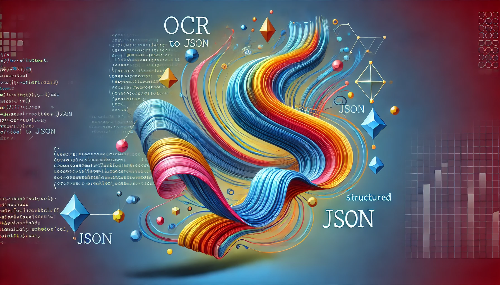
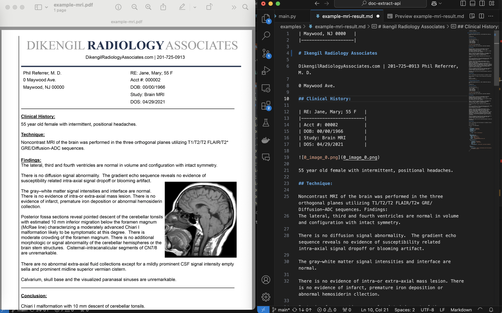
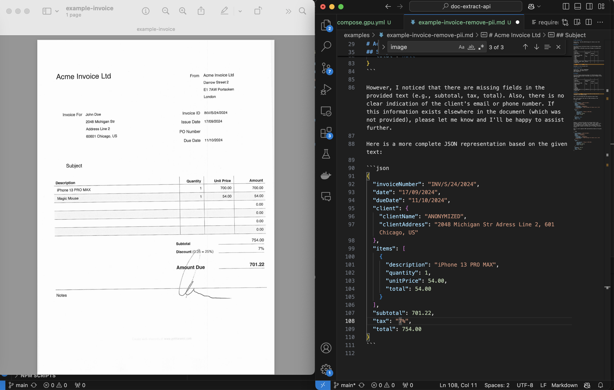

# pdf-extract-api

Convert any image or PDF to Markdown text or JSON structured document with super-high accuracy, including tabular data, numbers or math formulas.

The API is built with FastAPI and uses Celery for asynchronous task processing. Redis is used for caching OCR results.



## Features:
- **No Cloud/external dependencies** all you need: PyTorch based OCR (Marker) + Ollama are shipped and configured via `docker-compose` no data is sent outside your dev/server environment,
- **PDF to Markdown** conversion with very high accuracy using different OCR strategies including [marker](https://github.com/VikParuchuri/marker), [surya-ocr](https://github.com/VikParuchuri/surya) or [tessereact](https://github.com/h/pytesseract)
- **PDF to JSON** conversion using Ollama supported models (eg. LLama 3.1)
- **LLM Improving OCR results** LLama is pretty good with fixing spelling and text issues in the OCR text
- **Removing PII** This tool can be used for removing Personally Identifiable Information out of PDF - see `examples`
- **Distributed queue processing** using [Celery][(](https://docs.celeryq.dev/en/stable/getting-started/introduction.html))
- **Caching** using Redis - the OCR results can be easily cached prior to LLM processing
- **CLI tool** for sending tasks and processing results 

## Screenshots

Converting MRI report to Markdown + JSON.

```bash 
python client/cli.py ocr --file examples/example-mri.pdf --prompt_file examples/example-mri-2-json-prompt.txt
```

Before running the example see [getting started](#getting-started)



Converting Invoice to JSON and remove PII

```bash 
python client/cli.py ocr --file examples/example-invoice.pdf --prompt_file examples/example-invoice-remove-pii.txt 
```

Before running the example see [getting started](#getting-started)



**Note:** As you may observe in the example above, `marker-pdf` sometimes mismatches the cols and rows which could have potentially great impact on data accuracy. To improve on it there is a feature request [#3](https://github.com/CatchTheTornado/pdf-extract-api/issues/3) for adding alternative support for [`tabled`](https://github.com/VikParuchuri/tabled) model - which is optimized for tables.

## Getting started

You might want to run the app directly on your machine for development purposes OR to use for example Apple GPUs (which are not supported by Docker at the moment).

To have it up and running please execute the following steps:

[Download and install Ollama](https://ollama.com/download)
[Download and install Docker](https://www.docker.com/products/docker-desktop/)

If you are on Mac or just need to have your dependencies well organized, create a [virtual python env](https://docs.python.org/3/library/venv.html):

```bash
python3 -m venv .venv
source .venv/bin/activate
# now you've got access to `python` and `pip` commands
```

Configure environment variables:

```bash
cp .env.localhost.example .env.localhost
```

You might want to just use the defaults - should be fine. After ENV variables are set, just execute:

```bash
chmod +x run.sh
run.sh
```

This command will install all the dependencies - including Redis (via Docker, so it is not entirely docker free method of running `pdf-extract-api` anyways :)

Then you're good to go with running some CLI commands like:

```bash

```

## Getting started with Docker

### Prerequisites

- Docker
- Docker Compose

### Clone the Repository

```sh
git clone https://github.com/CatchTheTornado/pdf-extract-api.git
cd pdf-extract-api
```

### Setup environmental variables

Create `.env` file in the root directory and set the necessary environment variables. You can use the `.env.example` file as a template:

`cp .env.example .env`

Then modify the variables inside the file:

```bash
REDIS_CACHE_URL=redis://redis:6379/1
OLLAMA_API_URL=http://ollama:11434/api

# CLI settings
OCR_URL=http://localhost:8000/ocr
RESULT_URL=http://localhost:8000/ocr/result/{task_id}
CLEAR_CACHE_URL=http://localhost:8000/ocr/clear_cache
```

### Build and Run the Docker Containers

Build and run the Docker containers using Docker Compose:

```bash
docker-compose up --build
```

... for GPU support run:

```bash
docker-compose -f docker-compose.gpu.yml up --build
```

**Note:** While on Mac - Docker does not support Apple GPUs. In this case you might want to run the application natively without the Docker Compose


This will start the following services:
 - **FastAPI App**: Runs the FastAPI application.
 - **Celery Worker**: Processes asynchronous OCR tasks.
 - **Redis**: Caches OCR results.
 - **Ollama**: Runs the Ollama model.


## Hosted edition

If the on-prem is too much hassle [ask us about the hosted/cloud edition](mailto:info@catchthetornado.com?subject=pdf-extract-api%20but%20hosted) of pdf-extract-api, we can setup it you, billed just for the usage.

## CLI tool

**Note**: While on Mac, you may need to create a virtual Python environment first:

```bash
python3 -m venv .venv
source .venv/bin/activate
# now you've got access to `python` and `pip` within your virutal env.
pip install -r app/requirements.txt # install main project requirements
```


The project includes a CLI for interacting with the API. To make it work first run:

```bash
cd client
pip install -r requirements.txt
```


### Pull the LLama3.1 model

You might want to test out [different models supported by LLama](https://ollama.com/library)

```bash
python client/cli.py llm_pull --model llama3.1
```


### Upload a File for OCR (converting to Markdown)

```bash
python client/cli.py ocr --file examples/example-mri.pdf --ocr_cache
```


### Upload a File for OCR (processing by LLM)

```bash
python client/cli.py ocr --file examples/example-mri.pdf --ocr_cache --prompt_file=examples/example-mri-remove-pii.txt
```

### Get OCR Result by Task ID

```bash
python client/cli.py result -task_id {your_task_id_from_upload_step}
```

### Clear OCR Cache

```bash
python client/cli.py clear_cache
```

### Test LLama

```bash
python llm_generate --prompt "Your prompt here"
```

## Endpoints

### OCR Endpoint
- **URL**: /ocr
- **Method**: POST
- **Parameters**:
  - **file**: PDF file to be processed.
  - **strategy**: OCR strategy to use (`marker` or `tesseract`).
  - **ocr_cache**: Whether to cache the OCR result (true or false).
  - **prompt**: When provided, will be used for Ollama processing the OCR result
  - **model**: When provided along with the prompt - this model will be used for LLM processing

Example:

```bash
curl -X POST -H "Content-Type: multipart/form-data" -F "file=@examples/example-mri.pdf" -F "strategy=marker" -F "ocr_cache=true" -F "prompt=" -F "model=" "http://localhost:8000/ocr" 
```

### OCR Result Endpoint
- **URL**: /ocr/result/{task_id}
- **Method**: GET
- **Parameters**:
  - **task_id**: Task ID returned by the OCR endpoint.

Example:

```bash
curl -X GET "http://localhost:8000/ocr/result/{task_id}"
```

### Clear OCR Cache Endpoint
 - **URL**: /ocr/clear_cache
 - **Method**: POST

Example:
```bash
curl -X POST "http://localhost:8000/ocr/clear_cache"
```


### Ollama Pull Endpoint
- **URL**: /llm_pull
- **Method**: POST
- **Parameters**:
  - **model**: Pull the model you are to use first

Example:

```bash
curl -X POST "http://localhost:8000/llama_pull" -H "Content-Type: application/json" -d '{"model": "llama3.1"}'
```

### Ollama Endpoint
- **URL**: /llm_generate
- **Method**: POST
- **Parameters**:
  - **prompt**: Prompt for the Ollama model.
  - **model**: Model you like to query

Example:

```bash
curl -X POST "http://localhost:8000/llama_generate" -H "Content-Type: application/json" -d '{"prompt": "Your prompt here", "model":"llama3.1"}'
```

## License
This project is licensed under the GNU General Public License. See the [LICENSE](LICENSE.md) file for details.

**Important note on [marker](https://github.com/VikParuchuri/marker) license***:

The weights for the models are licensed `cc-by-nc-sa-4.0`, but Marker's author will waive that for any organization under $5M USD in gross revenue in the most recent 12-month period AND under $5M in lifetime VC/angel funding raised. You also must not be competitive with the [Datalab API](https://www.datalab.to/). If you want to remove the GPL license requirements (dual-license) and/or use the weights commercially over the revenue limit, check out the options [here](https://www.datalab.to/).


## Contact
In case of any questions please contact us at: info@catchthetornado.com
